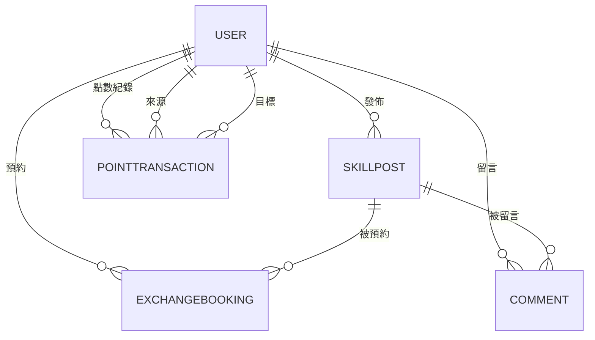

# 社區技能交換平台 SkillSwap

## 專案簡介
SkillSwap 是一個讓社區成員以「時間點數」交換技能服務的平台。會員可刊登技能服務、預約他人服務、留言討論，並透過點數管理交換紀錄。

## 技術架構
- 後端：純 PHP
- 資料庫：MySQL
- 運行環境：XAMPP（htdocs 目錄下）

## 主要功能
- 會員註冊／登入／登出
- 技能服務刊登（CRUD）
- 技能服務搜尋與瀏覽
- 預約交換（建立、查詢、狀態變更）
- 點數管理（累積、扣減、轉讓、交易紀錄查詢）
- 留言討論（CRUD）

## 資料表設計

### User（會員）
| 欄位         | 型態         | 說明         |
| ------------ | ------------ | ------------ |
| user_id      | INT PK AI    | 會員ID       |
| email        | VARCHAR(255) | 電子郵件     |
| password_hash| VARCHAR(255) | 密碼雜湊     |
| name         | VARCHAR(100) | 暱稱         |
| created_at   | DATETIME     | 註冊時間     |

### SkillPost（服務刊登）
| 欄位         | 型態         | 說明         |
| ------------ | ------------ | ------------ |
| post_id      | INT PK AI    | 貼文ID       |
| user_id      | INT FK       | 發文會員     |
| title        | VARCHAR(100) | 標題         |
| description  | TEXT         | 內容         |
| point_cost   | INT          | 點數需求     |
| created_at   | DATETIME     | 發布時間     |

### ExchangeBooking（交換預約）
| 欄位         | 型態         | 說明         |
| ------------ | ------------ | ------------ |
| booking_id   | INT PK AI    | 預約ID       |
| post_id      | INT FK       | 服務貼文     |
| requester_id | INT FK       | 預約會員     |
| status       | ENUM         | 狀態（待確認/已完成/已取消）|
| scheduled_at | DATETIME     | 預約時間     |

### PointTransaction（點數紀錄）
| 欄位         | 型態         | 說明         |
| ------------ | ------------ | ------------ |
| tx_id        | INT PK AI    | 交易ID       |
| from_user_id | INT FK       | 來源會員     |
| to_user_id   | INT FK NULL  | 目標會員     |
| amount       | INT          | 點數（正負） |
| reason       | VARCHAR(255) | 原因         |
| created_at   | DATETIME     | 交易時間     |

### Comment（留言）
| 欄位         | 型態         | 說明         |
| ------------ | ------------ | ------------ |
| comment_id   | INT PK AI    | 留言ID       |
| post_id      | INT FK       | 貼文         |
| user_id      | INT FK       | 留言會員     |
| content      | TEXT         | 內容         |
| created_at   | DATETIME     | 留言時間     |

## ER 圖（資料表關聯）


## 專案資料夾建議結構
```
/termproject
  /public         # 靜態資源與入口（如 index.php）
  /src            # PHP 程式碼（如功能模組）
  /templates      # 前端模板
  /sql            # 資料表建立語法
  README.md
```

## 安裝與執行方式
1. 將本專案放置於 XAMPP 的 `htdocs` 目錄下。
2. 匯入 `/sql` 內的資料表建立語法至 MySQL。
3. 以瀏覽器開啟 `http://localhost/termproject/public/index.php` 開始使用。

## 期末專案規劃說明
本專案以純 PHP + MySQL 實作，強調資料表設計與功能模組分工，適合 XAMPP 環境快速開發與展示。